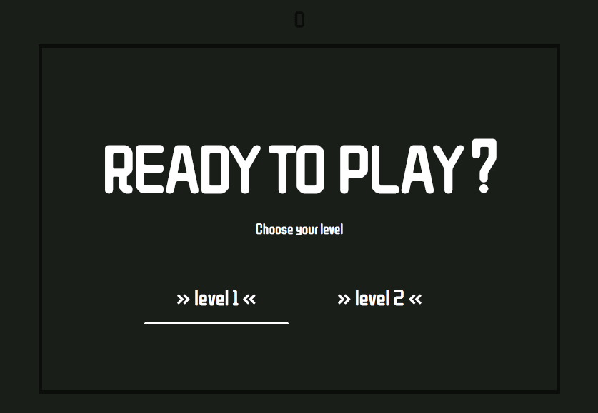
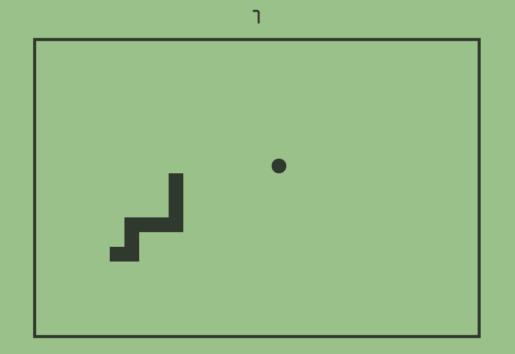
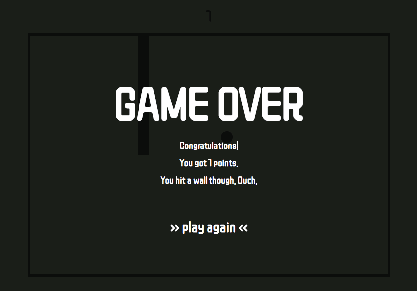

# Snake Game

T​his​ is my implementation of a classic game - Snake :snake: :snake: :snake: ​. I gave it an old-school look, so that it would remind the times of monochrome phones like Nokia 3310. 

Move the snake across the board with arrows on your keyboard (↑ ↓ ← →) and have fun!


## Getting Started

To run this project you need to have **Node.js** installed on your local machine. After forking and cloning the repo please run these commands in your command line:

```
npm i
```

and

```
npm start
```

The project will be running in your browser at <http://localhost:8080/>.


## Tools

- JavaScript (ES6)
- Sass
- Webpack


## Features

Apart from the obvious:

- If the snake hits a wall, game is over. You cannot get through a wall to the other side of the board.
- You can choose a level. They differ in speed.
- The snake speeds up every 10 points (up to 50) you get.
- You can use your keyboard (arrows, space, enter) to navigate and (re-)start the game.
- The game-over messages differ depending on your final score.


## Demo

### [Snake Game](https://karin-on.github.io/snake/)


## Previews







